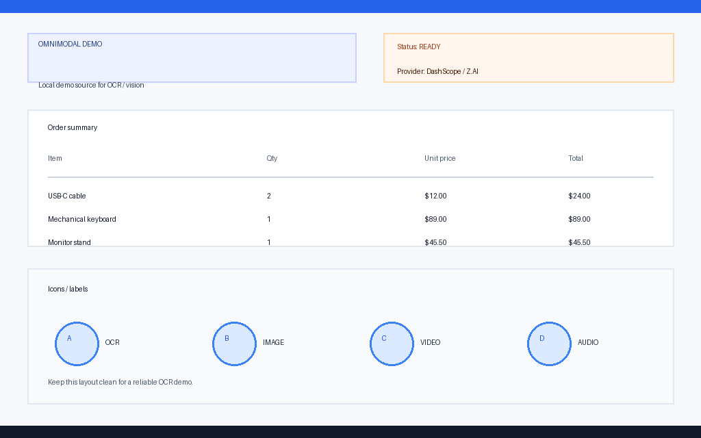

# Omnimodal v3.1.0

Omnimodal gives text-only models multimodal capabilities: recognize images, video, and audio, and generate images, video, and audio through Qwen/DashScope, Z.AI/GLM, or OpenAI-compatible APIs.

## Positioning

Omnimodal is an MCP-based multimodal capability layer for text-only agents, including DeepSeek. Instead of replacing the underlying model, it exposes stable MCP tools so agents can perceive, process, and generate image, video, and audio media.

Design goals:

- Stable tool names, arguments, and return formats for agent automation.
- Recognition and generation are separated; generated output is not automatically recognized again.
- Batch, clipboard, dragged media, web capture, and native Windows capture are supported.
- Cost confirmation, async `task_id`, media conversion/compression, log redaction, and remote URL protection are built in.

## DeepSeek Harness Integration

The project is ready to be registered as a plugin, skill, or MCP component in the DeepSeek Harness ecosystem:

- Four stdio MCP servers: `omnimodal-recognize`, `omnimodal-generation`, `omnimodal-capture-page`, and `omnimodal-windows-capture`.
- Tool names, configuration, and return formats are stable.
- Image, video, and audio recognition and generation support async tasks with `task_id`.
- When DSH is available, MCP registration, tool discovery, media upload/cleanup, and cost confirmation can be adapted first.

## Architecture

```text
Agent (Codex / Claude Code / DSH)
         │  MCP stdio
         ▼
omnimodal-recognize / omnimodal-generation
omnimodal-capture-page / omnimodal-windows-capture
         │  HTTP
         ▼
Qwen / DashScope, Z.AI, OpenAI-compatible APIs
```

## Tools

### Recognition

- `omnimodal_recognize_image(image, task, mode)`
- `omnimodal_recognize_images_batch(images, task, mode, max_workers)`
- `omnimodal_recognize_video(video, task, mode)`
- `omnimodal_recognize_videos_batch(videos, task, mode, max_workers)`
- `omnimodal_recognize_audio(audio, task, mode)`
- `omnimodal_recognize_audios_batch(audios, task, mode, max_workers)`
- `omnimodal_read_clipboard_image(task, mode)`
- `omnimodal_read_dragged_image(task, mode, path)`
- `omnimodal_read_dragged_video(task, mode, path)`
- `omnimodal_read_dragged_audio(task, mode, path)`

### Generation

- `omnimodal_generate_image(prompt, tier, size, n, wait, confirm)`
- `omnimodal_generate_video(prompt, tier, duration, resolution, wait, confirm)`
- `omnimodal_generate_video_from_image(image, prompt, tier, duration, resolution, wait, confirm)`
- `omnimodal_edit_video(video, prompt, tier, duration, resolution, reference_image, wait, confirm)`
- `omnimodal_generate_audio(text, voice, tier, kind, preview_text, wait, confirm)`
- `omnimodal_transcribe_audio(audio, language, wait)`
- `omnimodal_get_task_result(task_id)`

Generation tools only call paid APIs when `confirm=true`. Results are saved to `~/.omnimodal/outputs`.
After generation, return the result path directly; do not automatically recognize it unless the user explicitly asks to verify the output.

Video generation resolution supports `720P/1080P`; `480P` is upgraded to `720P`.
For `omnimodal_generate_audio`, `kind` supports `tts`, `clone`, `voice_design`, and `music`.
`music` uses `fun-music-v1`, which is an invite-only Alibaba Cloud model and may return `AccessDenied` until enabled.

### Capture

- `omnimodal_capture_page(url, actions, viewport, output_dir)`
- `omnimodal_list_windows()`
- `omnimodal_capture_windows(mode, window, output_dir)`

## Install

Requires Python 3.10+ and `uv`.

```powershell
git clone https://github.com/good-boy4069/Deepseek-omnimodal.git
cd Deepseek-omnimodal
Copy-Item .env.example .env
```

Set `OMNIMODAL_API_KEY` in `.env`. For Claude Code:

Switch providers with `OMNIMODAL_PROVIDER`. Examples:

```powershell
# Z.AI / GLM
OMNIMODAL_PROVIDER=zai
OMNIMODAL_BASE_URL=https://api.z.ai/api/paas/v4
OMNIMODAL_IMAGE_MODEL=glm-5v-turbo
OMNIMODAL_OCR_MODEL=glm-ocr
OMNIMODAL_ASR_MODEL=glm-asr-2512
OMNIMODAL_IMAGE_GEN_MODEL_STANDARD=glm-image
OMNIMODAL_VIDEO_GEN_MODEL_STANDARD=cogvideox-3
OMNIMODAL_VIDEO_GEN_BASE_URL=https://api.z.ai/api/paas/v4
```

```powershell
# OpenAI or an OpenAI-compatible service
OMNIMODAL_PROVIDER=openai_compatible
OMNIMODAL_BASE_URL=https://api.openai.com/v1
OMNIMODAL_IMAGE_MODEL=gpt-4o-mini
```

```powershell
powershell -ExecutionPolicy Bypass -File .\scripts\install_claude_plugin.ps1
```

Restart Claude Code after installation.

## Configuration

- `config/model_catalog.json`: models, capabilities, pricing, timeouts.
- `config/profiles.json`: recognition profile defaults.
- `config/local.json`: local overrides, ignored by Git.

Important environment variables:

- `OMNIMODAL_API_KEY`
- `OMNIMODAL_PROVIDER`
- `OMNIMODAL_BASE_URL`
- `OMNIMODAL_IMAGE_MODEL`
- `OMNIMODAL_VIDEO_MODEL`
- `OMNIMODAL_AUDIO_MODEL_STANDARD`
- `OMNIMODAL_AUDIO_MODEL_PRO`
- `OMNIMODAL_VIDEO_GEN_MODEL_STANDARD_I2V`
- `OMNIMODAL_VIDEO_GEN_MODEL_MAX_I2V`
- `OMNIMODAL_VIDEO_GEN_MODEL_EDIT`
- `OMNIMODAL_OCR_MODEL`
- `OMNIMODAL_ASR_MODEL`
- `OMNIMODAL_GENERATION_MODEL`
- `OMNIMODAL_VIDEO_GEN_BASE_URL`
- `OMNIMODAL_AUDIO_GEN_BASE_URL`
- `OMNIMODAL_IMAGE_GEN_TIMEOUT_SEC`
- `OMNIMODAL_VIDEO_GEN_TIMEOUT_SEC`
- `OMNIMODAL_AUDIO_GEN_TIMEOUT_SEC`
- `OMNIMODAL_MAX_VIDEO_DURATION`
- `OMNIMODAL_GENERATION_OUTPUT_DIR`
- `OMNIMODAL_ALLOWED_OUTPUT_DIRS`
- `OMNIMODAL_ALLOW_PRIVATE_URLS`

## Provider support

- `dashscope`: full recognition plus image/video/audio generation (default).
- `zai`: GLM image/video/audio understanding, GLM image generation, GLM video generation, and GLM ASR. Image editing, TTS, voice cloning, and music generation are not currently public.
- `openai_compatible`: recognition and OpenAI Images-style image generation. Video/audio generation is not supported because there is no unified standard.

## Demo

The demo source is a locally generated OCR/vision sample, not personal media:



Run it with:

```powershell
uv run --project <plugin-root> omnimodal-recognize --image docs/demo-source.png --task "Extract all text, table, and labels" --mode standard
```

The actual output summary is stored in `docs/demo-output.txt`.

## Security

- API keys are only read from `.env` or system environment variables.
- Remote URLs block private, local, and cloud metadata addresses by default.
- Logs redact API keys, query parameters, Base64, and media bodies.
- Generation tools require explicit cost confirmation.

## Maintainer

- GitHub: https://github.com/good-boy4069
- Repository: https://github.com/good-boy4069/Deepseek-omnimodal
