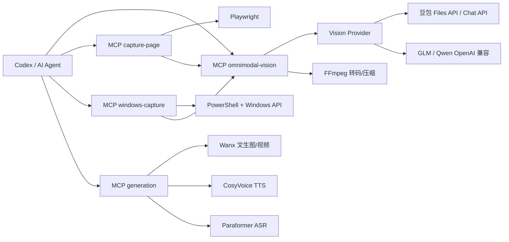

# Omnimodal v2.0.0

> 本项目原名 read-image，已升级为全模态（omnimodal）。

Codex 插件：让纯文本主模型读取本地图片、批量图片、视频和网页截图。默认使用通义千问 qwen3-vl-flash（DashScope 兼容模式），也支持 GLM 和豆包等 OpenAI 兼容视觉接口。

[English](README.en.md) | [中文](README.md)

## 已知限制

Claude 桌面端不支持直接识别跨窗口拖拽的图片和视频。从其他应用拖入 Claude 桌面端聊天框的媒体不会落盘，纯文本模型只能看到 `[Unsupported Image]` 占位符，`read_dragged_image` / `read_dragged_video` 无法找到。

推荐工作流：
1. 拖入后 `Ctrl+C` 复制，调用 `read_clipboard_image`。
2. 或把文件保存到明确路径，提供路径调用 `read_image/read_video`。

## 功能

**识别（vision server）**
- `read_image(image, task, mode)`：读取单张本地图片、data URL 或 base64 图片数据。
- `read_clipboard_image(task, mode)`：保存并读取 Windows 剪贴板图片，直接返回识别结果。
- `read_dragged_image(task, mode, path)` / `read_dragged_video(task, mode, path)`：扫描最近拖入的图片/视频（仅适用于会落盘的客户端）。
- `read_images_batch(images, task, mode, max_workers)`：并行读取多张图片并按原顺序返回。
- `read_video(video, task, mode)`：读取本地视频或视频 URL，本地视频优先 Files API，失败自动回退 Base64，支持转 MP4 和压缩。
- `read_audio(audio, task, mode)`：音频内容理解（qwen3.5-omni，支持语气/音效/混合内容）。
- `transcribe_audio(audio, language, wait)`：语音转文字（fun-asr，0.79 元/小时）。
- `capture_page(url, actions, viewport, output_dir)`：用 Playwright 交互式截图。
- `list_windows()`：列出当前可见 Windows 窗口标题。
- `capture_windows(mode, window, output_dir)`：截取 Windows 全屏、主屏或指定窗口并返回 PNG 路径。

**生成（generation server）**
- `generate_image(prompt, tier, size, n, wait)`：文生图（qwen-image-2.0 0.2 元/张 / wan2.7-image-pro 0.5 元/张）。
- `generate_video(prompt, tier, duration, resolution, wait)`：文生视频（wan2.7-t2v 0.6-1 元/秒 / happyhorse 0.27-0.72 元/秒）。
- `generate_video_from_image(image, prompt, tier, wait)`：图生视频（以图片为首帧）。
- `generate_speech(text, voice, tier)`：语音合成 TTS（qwen-audio-3.0-tts 1 元/万字符 / cosyvoice-v3.5-plus 1.5 元/万字符）。
- `get_generation_result(task_id)`：查询异步生成/转写任务结果。

**tier 档位**：每类能力有完整模型梯度（standard/pro/max），按需求自动选择——日常用 standard（便宜），重要任务用 pro/max。`READ_IMAGE_DEFAULT_TIER` 全局调档。

## 架构



## 安装

在 Codex 中启用本插件后，插件会通过 `.mcp.json` 自动启动三个 MCP 服务。项目使用 `uv` 管理依赖：

```powershell
uv run --project . read-image-vision --help
uv run --project . read-image-capture-page --help
uv run --project . read-image-windows-capture --help
```

如果使用默认 Chromium 而不是本机 Edge/Chrome，需要先安装 Playwright 浏览器：

```powershell
uv run --project . --with playwright playwright install chromium
```

## Claude Code 安装

Claude Code 原生插件已经内置。临时测试：

```powershell
claude --plugin-dir <插件根目录>
```

持久安装到 Claude Code 的本地 skills 目录：

```powershell
powershell -ExecutionPolicy Bypass -File <插件根目录>\scripts\install_claude_plugin.ps1
```

安装后重启 Claude Code，先运行 `/mcp` 确认能看到 `read-image`、`capture-page`、`windows-capture`。Claude Code 中的 MCP 工具名可能带 `mcp__plugin_...` 前缀，以 `/mcp` 显示的实际名称调用。

首次使用如果看到“Pending approval”，在 Claude Code 中批准对应 MCP 服务即可。需要 API Key 时，在插件根目录创建 `.env`，或设置 `READ_IMAGE_API_KEY` 等系统环境变量。

## 图片输入格式

`read_image` 的 `image` 参数支持：
- 本地图片路径，例如 `C:/path/to/image.png`
- data URL，例如 `data:image/png;base64,AAAA...`
- 可解码为图片的纯 base64 字符串

`read_image` 可以读取当前用户可访问的本地文件。请勿用它读取密码、密钥、认证材料等敏感文件，也不要让模型自行扫描与任务无关的目录。

如果 Claude 桌面端粘贴图片没有可靠路径，不要猜测临时目录旧文件。优先使用 data URL/base64；拿不到数据时运行：

```powershell
powershell -STA -ExecutionPolicy Bypass -File <插件根目录>\scripts\save_clipboard_image.ps1
```

脚本会返回稳定 PNG 路径，再交给 `read_image`。

更好的方式是直接调用 MCP 工具：

```python
await read_clipboard_image(
    task="描述剪贴板图片内容",
    mode="standard",
)
```

`read_clipboard_image` 会保存剪贴板图片并自动识别，Claude 不需要扫描临时目录或按时间戳猜文件。

## 拖拽媒体识别

从其他应用拖拽图片或视频到聊天框时，如果会话没有可靠路径，调用：

```python
await read_dragged_image(
    task="描述图片内容",
    mode="standard",
)
```

工具会扫描 `%TEMP%` 和 `READ_DRAG_DIRS` 指定目录，默认只看最近 30 分钟、匹配白名单前缀的文件。单候选自动识别；多候选会列出路径，调用方必须通过 `path` 参数确认后再识别。

可通过以下环境变量调整：

- `READ_DRAG_WINDOW_MIN`：时间窗口，默认 30 分钟。
- `READ_DRAG_PATTERNS`：逗号分隔的白名单 glob，默认包含 `codex-clipboard-*`、`pasted_image*`、`current_paste*`、`pasted_*`、`claude-*`、`*.tmp`。
- `READ_DRAG_DIRS`：分号分隔的附加扫描目录。

缓存默认包含 task，同一张图不同问题不会串结果；`READ_IMAGE_CACHE_TTL_SEC` 默认 300 秒。

极端长宽比图片会自动切片识别，避免被压成细条后产生幻觉。阈值由 `READ_IMAGE_EXTREME_ASPECT_RATIO_LIMIT` 控制，默认 `8`，设为 `0` 可关闭。

## 配置

公开仓库不包含任何 API Key。使用前在插件根目录创建本地 `.env`：

```powershell
READ_IMAGE_API_KEY=你的 DashScope API Key
READ_IMAGE_PROVIDER=openai_compatible
READ_IMAGE_BASE_URL=https://dashscope.aliyuncs.com/compatible-mode/v1
READ_IMAGE_MODEL=qwen3-vl-flash
```

也兼容系统环境变量 `ARK_API_KEY`、`DOUBAO_API_KEY`、`VISION_API_KEY`。`.env` 不会进入 Git；更多配置参考 `.env.example`。

图片默认最大边为 2048，`READ_IMAGE_FORMAT=auto` 会保留 PNG 等无损格式，避免截图文字被 JPEG 压缩弄糊。批量识别支持 `READ_IMAGE_BATCH_TIMEOUT_SEC` 单图超时。视频新增 `READ_VIDEO_BASE64_MAX_MB`（Base64 回退上限 45MB）、`READ_VIDEO_DOWNLOAD_MAX_MB`（远程下载上限 512MB）和 `READ_VIDEO_FILES_API_TIMEOUT_SEC`。

截图输出目录默认只允许临时目录和当前工作区；需要其他目录时通过 `READ_IMAGE_ALLOWED_OUTPUT_DIRS` 配置。`READ_VIDEO_KEEP_AUDIO=1` 可保留视频音轨，默认去掉音轨以兼容当前视觉模型。

远程 URL 默认禁止本机、内网和云元数据地址；本地调试需要访问时设置 `READ_IMAGE_ALLOW_PRIVATE_URLS=1`。视频任务使用独立工作池，可通过 `READ_VIDEO_WORKERS` 调整并发数，默认 2；旧的 `READ_IMAGE_VIDEO_WORKERS` 继续兼容。

## 切换视觉 Provider

默认使用通义千问 qwen3-vl-flash（DashScope 兼容模式）：

```powershell
READ_IMAGE_PROVIDER=openai_compatible
READ_IMAGE_BASE_URL=https://dashscope.aliyuncs.com/compatible-mode/v1
READ_IMAGE_MODEL=qwen3-vl-flash
```

也可设置 `READ_IMAGE_PROVIDER=auto`：设置了 `READ_IMAGE_BASE_URL` 和 `READ_IMAGE_MODEL` 时自动切换为通用 OpenAI 兼容 Provider，否则使用豆包。

切回豆包：

```powershell
READ_IMAGE_PROVIDER=doubao
READ_IMAGE_BASE_URL=https://ark.cn-beijing.volces.com/api/v3
READ_IMAGE_MODEL=doubao-seed-2-1-turbo-260628
```

GLM：

```powershell
READ_IMAGE_PROVIDER=openai_compatible
READ_IMAGE_BASE_URL=https://open.bigmodel.cn/api/paas/v4
READ_IMAGE_MODEL=glm-5v-turbo
```

以上模型 ID 只是示例，请以你实际开通的模型为准。通用 Provider 的图片会按 OpenAI 兼容格式发送；视频会自动回退 Base64（上限 `READ_VIDEO_BASE64_MAX_MB`，默认 45MB），目标模型不接受时返回“当前模型不支持视频”。GLM/Qwen 的 thinking 参数由 `READ_IMAGE_OPENAI_THINKING_PARAM=auto|thinking|enable_thinking|none` 控制，`auto` 会按模型名自动选择。

六档 mode 仍可单独覆盖：

```powershell
READ_IMAGE_PROFILES_JSON={"quick":{"max_tokens":256,"timeout_sec":20,"thinking":false,"prompt":"只输出关键文字"}}
```

## 模型梯度与 tier 档位

每类能力提供完整模型梯度（便宜 → 贵），按需求自动选择，像 mode 一样灵活：

| 能力 | standard（默认） | pro | max |
|---|---|---|---|
| 图片理解 | qwen3-vl-flash（3.3 元/M） | qwen3-vl-plus | qwen3.8-max（旗舰） |
| OCR（mode=ocr） | **qwen-vl-ocr（0.3/0.5 元/M）** | — | — |
| 视频理解 | qwen3-vl-flash | — | qwen3.8-max（长视频深度） |
| 音频理解 | qwen3.5-omni-flash（1 分/分钟） | qwen3.5-omni-plus | — |
| 语音转写 | fun-asr（0.79 元/小时） | paraformer-v2（0.288 元/小时） | — |
| 文生图 | qwen-image-2.0（0.2 元/张） | wan2.7-image-pro（0.5 元/张） | — |
| 文生视频 | wan2.7-t2v（0.6 元/秒） | wan2.7-t2v（1 元/秒） | happyhorse-1.1-t2v（0.72 元/秒） |
| 图生视频 | wan2.7-i2v | happyhorse-1.1-i2v | — |
| 语音合成 | qwen-audio-3.0-tts（1 元/万字符） | cosyvoice-v3.5-plus（1.5 元/万字符） | — |

**档位自动选择规则**（SKILL.md 指导主模型）：无修饰词或"随便/快速"→ standard；"高质量/专业/商用"→ pro；"电影级/旗舰/大片"→ max。`READ_IMAGE_DEFAULT_TIER=standard|pro|max` 可全局调档——**DeepSeek V5 Pro 上线后主模型变强，可将默认档上调至 pro/max**，多模态能力随之升级。

**费用提示**：所有生成工具调用前，主模型会先向用户说明预计费用（如"生成 5 秒 wan2.7-t2v 视频约 3 元"），用户确认后才执行；结果返回时附实际费用。

## 调用示例（生成）

```python
await read_image(
    image="C:/path/to/image.png",
    task="提取图中所有文字",
    mode="standard",
)
```

```python
await read_images_batch(
    images=["C:/a.png", "C:/b.png"],
    task="描述每张图内容",
    mode="standard",
    max_workers=4,
)
```

```python
await read_video(
    video="C:/path/to/video.mp4",
    task="按时间顺序描述画面变化",
    mode="quick",
)
```

```python
paths = await capture_page(
    url="https://example.com",
    actions=[{"action": "click", "selector": "#menu"}],
    viewport="1280x800",
)
```

## 故障排查

- API Key 无效：检查插件根目录 `.env` 中 `READ_IMAGE_API_KEY` 是否为完整的 DashScope API Key，然后重新加载 Codex 插件。
- 远程 URL 被拒绝：插件默认阻止内网/本机地址；确需访问时设置 `READ_IMAGE_ALLOW_PRIVATE_URLS=1`。
- 网页截图失败：确认已安装 Playwright 浏览器，或设置 `CAPTURE_PAGE_BROWSER=msedge` / `chrome`。
- Windows 截图失败：先用 `list_windows()` 查看准确窗口标题；硬件加速窗口可能退回屏幕拷贝。
- 视频处理慢：视频任务运行在独立工作池中，可通过 `READ_VIDEO_WORKERS` 增加并发。

## 模式

- `ocr`：文字提取（OCR 专用模型，更便宜）。
- `quick`：快速识别，短 OCR。
- `standard`：标准提取，默认。
- `full`：完整提取。
- `quick_analysis`：快速分析。
- `balanced_analysis`：平衡分析。
- `deep_analysis`：深度分析。

视频模式下六档使用更长超时。本地视频默认 50MB 限制，超过会自动压缩；本地文件优先上传 Files API，模型不支持时回退 Base64；格式不支持会自动转成 MP4/H.264 后重试。远程 URL 优先直连，过大或格式错误时下载到临时目录再走本地处理。

## 开发

```powershell
uv sync --extra dev
uv run pytest
uv run ruff check .
uv run mypy omnimodal
uv run python scripts/validate_plugin.py
```

版本记录见 [CHANGELOG.md](CHANGELOG.md)。

## 隐私与条款

- [隐私政策](PRIVACY.md)
- [使用条款](TERMS.md)

## License

MIT License. Copyright (c) 2026 ZXY1240
